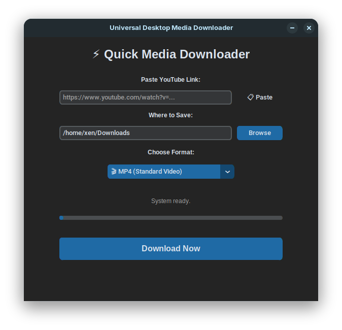

# Ytdownloader

A powerful, cross-platform YouTube video and audio downloader with a modern GUI.

## Features
- **Modern Interface**: Clean, dark-themed UI built with CustomTkinter.
- **Format Flexibility**: Download in MP4, MKV, MP3, or M4A quality.
- **Smart Clipboard**: Automatically detects and pastes links from your clipboard.
- **Visual Feedback**: Real-time progress bar for long downloads.
- **Desktop Notifications**: Get alerted the moment your file is ready.

## Technical Architecture
This application utilizes a multithreaded design to ensure a smooth user experience:

* **GUI Thread**: Manages the CustomTkinter interface, ensuring the app remains responsive during long operations.
* **Worker Thread**: Handles the heavy lifting—invoking yt-dlp to fetch streams—preventing the "Not Responding" errors common in single-threaded applications.
* **Media Processing**: Leverages imageio-ffmpeg to automate the complex task of merging video and audio streams seamlessly.

## Requirements
To run from source, ensure you have **Python 3.10+** and **FFmpeg** installed. 

Install the required dependencies using:
`pip install -r requirements.txt`

## Installation
### Pre-compiled Binary
1. Navigate to the **[Releases](https://github.com/xenxaarn/ytdownloader/releases)** page.
2. Download the binary matching your OS.
3. (Linux) Run `chmod +x ytdownloader` to grant execution permission.
4. Launch the application: `./ytdownloader`

### From Source
1. Clone the repository.
2. Create and activate a virtual environment: `python -m venv venv`
3. Install dependencies: `pip install -r requirements.txt`
4. Run the application: `python ytdownloader.py`

## Known Issues
Please report any bugs.

## License
This project is open-source under the **MIT License**.